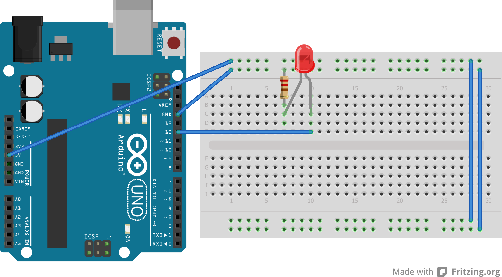

# NEUB CSE Microprocessor and Interfacing Lab Spring 2025 Lab 4

## Task 1
LED blinking code in Arduino.

Circuit:

[Code](task1.ino)

## Resources

## [Online Class](https://www.youtube.com/watch?v=ulclNTYsoGQ)
