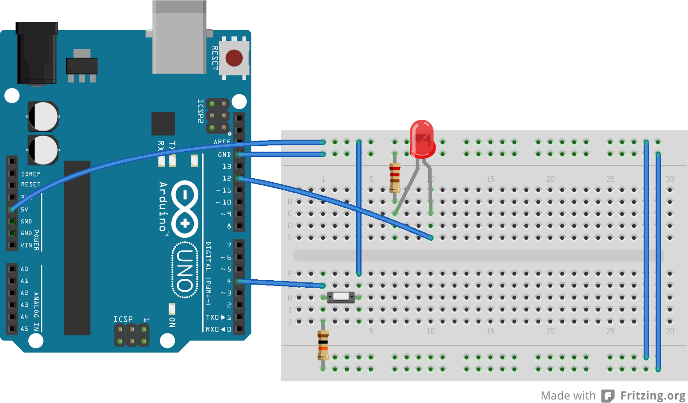

# Microprocessor and Interfacing Lab 5

## Task 1
LED blinking code in AVR.

Circuit:

[Code](task1.ino)

## Task 2
Basic Input and output code for AVR.

Circuit:

[Code](task2.ino)

## Resources
- [Online Class](https://www.youtube.com/watch?v=B4UmzWCzt7M)
