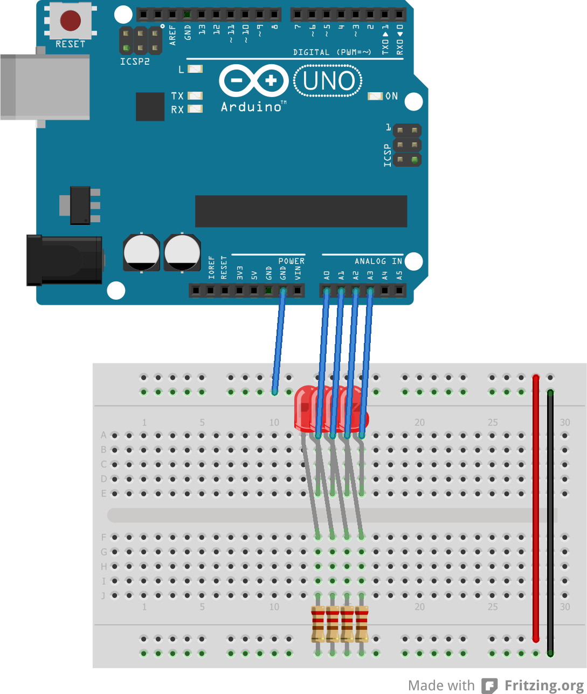
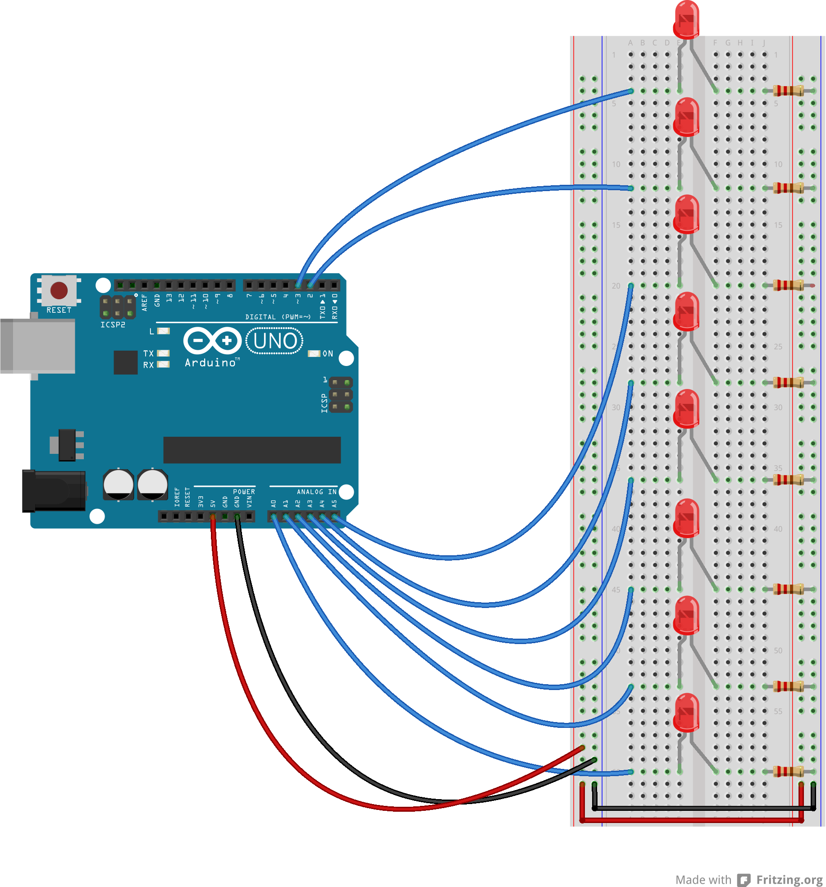
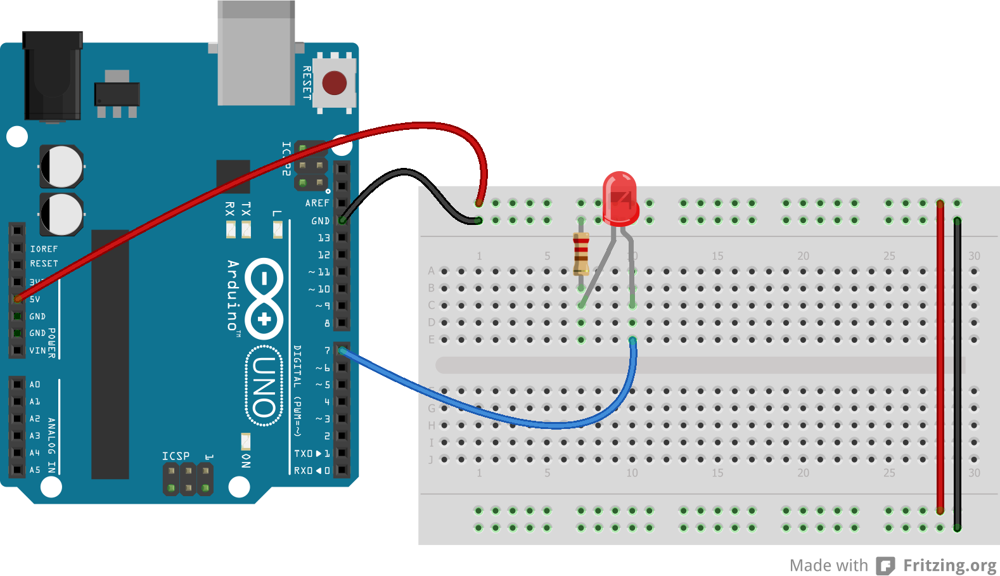

# Microprocessor and Interfacing Lab 6

## Task 1
EEPROM read and write code.

Circuit:
In either of the following circuits, you can use 4 or 8 LEDs. The circuit is the same, just the number of LEDs and the pins used are different. Use Resistance value of 220 ohm for each LED.
To use with 4 LEDs, use the following circuit:

To use with 8 LEDs, use the following circuit:

[Code](task1.ino)

## Task 2
Using EEPROM to store a pattern of LED and pulsing through the pattern.

Circuit:
In either of the following circuits, you can use 4 or 8 LEDs. The circuit is the same, just the number of LEDs and the pins used are different. Use Resistance value of 220 ohm for each LED.
To use with 4 LEDs, use the following circuit:

To use with 8 LEDs, use the following circuit:

[Code](task2.ino)

## Task 3
Create a function to output PWM with a specified duty cycle to any given pin. eg: pwm(pinName, dutyCycle);.

Circuit:

[Code](task3.ino)

## Task 4
PWM using analogWrite() function.
This task is to use the `analogWrite()` function to output PWM signals. The `analogWrite()` function takes two parameters: the pin number and the duty cycle (0-255).

Circuit:

[Code](task4.ino)

## Task 5
Use `analogWrite()` to create a fading LED effect.
This task is to use the `analogWrite()` along with `map()` function to output PWM signals by providing duty cycle as percentage. 

Circuit:

[Code](task5.ino)

## Resources
- ## [Online Class](https://www.youtube.com/watch?v=FBq0LM6HCyM)

