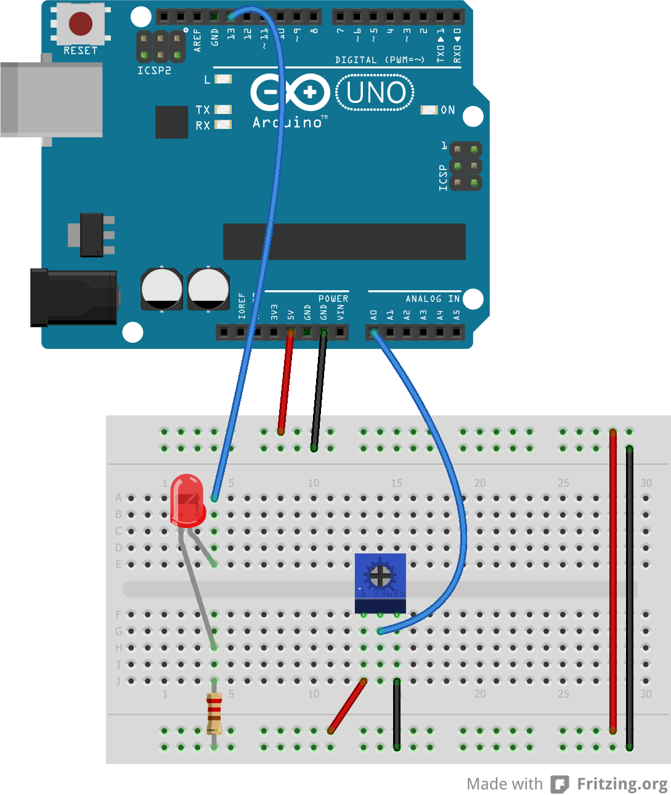
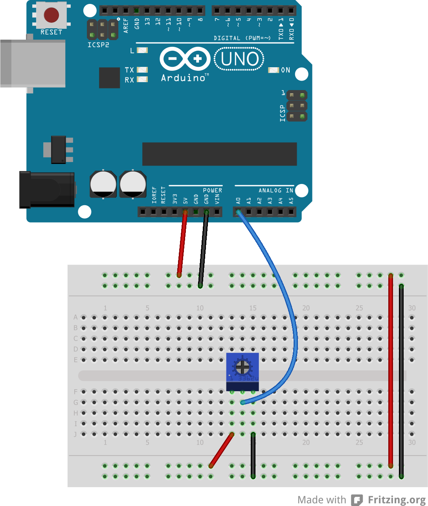
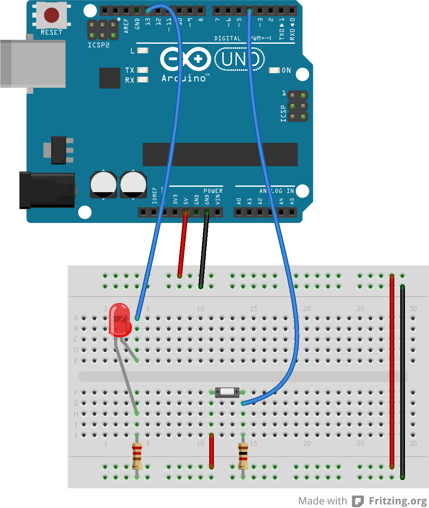

# Microprocessor and Interfacing Lab 7

## Task 1
Reading analong value using built-in ADC.

Circuit:

[Code](task1.ino)

## Task 2
Reading voltage using built-in ADC and showing it inb serial monitor.

Circuit:

[Code](task2.ino)

## Task 3
Using LDR as sensor.

Circuit:

[Code](task3.ino)

## Task 4
Write an arduino code change the status of LED (on or off) based on switch input.

Circuit:

[Code](task4.ino)

## Task 5
Write an arduino code change the status of LED (on or off) based on switch input with a debounce delay of 100ms. 

Circuit:

[Code](task5.ino)

## Task 6
Using switch with interrupt.

Circuit:

[Code](task6.ino)

## Resources
- [Online Class](https://youtu.be/-Ahjz8ojDtw)