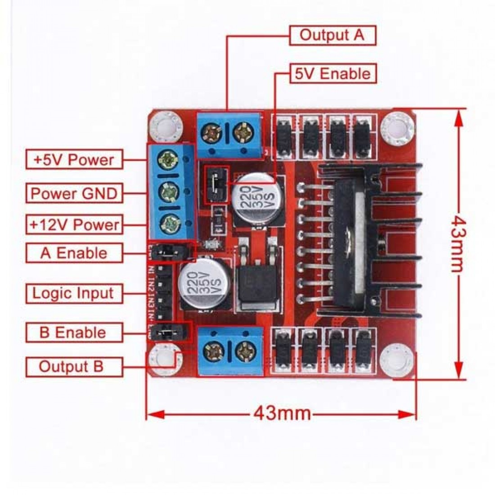
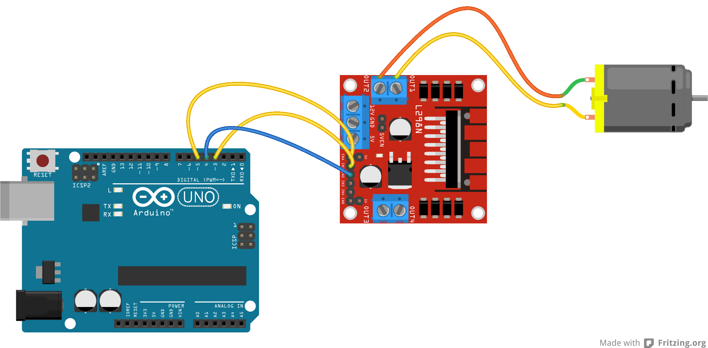
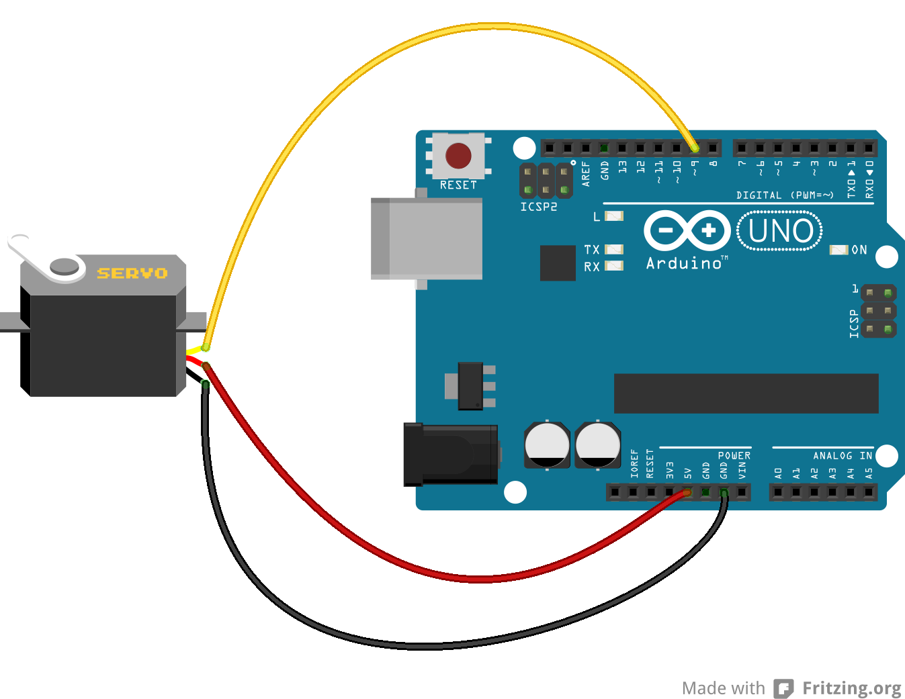

# Microprocessor and Interfacing Lab 8

## L298 Motor Driver Module

## Task 1
Driving DC motor using L298 motor driver module.

Circuit:

[Code](task1.ino)

## Task 2
Varying Speed of DC motor using L298 motor driver module.

Circuit:

[Code](task2.ino)

## Task 3
Driving a Servo motor.

Circuit:

[Code](task3.ino)

### Resources
- [Online Class](https://youtu.be/P47bwlIud5U)

