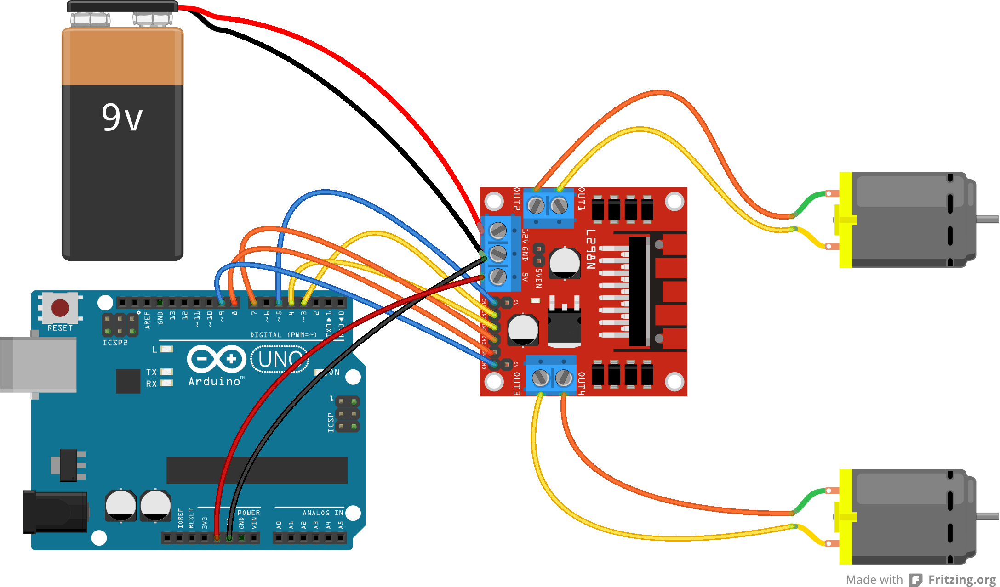

# Microprocessor and Interfacing Lab 9

## Task 1
Write a code to drive differential drive robot with two dc motors using L298 motor driver.

Circuit:

[Code](task1.ino)

## Task 2
Write a code to drive differential drive robot with two dc motors using L298 motor driver. Different movement should be incorporated using individual functions.

Circuit:

[Code](task2.ino)

## Task 3
Write a code to drive a differential drive robot with two dc motors with variable speed using L298 motor driver. Different movement should be incorporated using individual functions.

Circuit:

[Code](task3.ino)

## Overview of Robot Control Methods

### Light Follower Robot:

- **Light follower robot** uses light sensors to detect and move toward a light source.
- Typically has three sensors at the front to determine light direction.
- Adjusts movement based on sensor readings to follow the light.

### Line Follower Robot:

- **Line follower robot** uses infrared (IR) sensors to detect and follow a line on the ground.
- Typically, three or more IR sensors are placed at the front bottom of the robot.
- IR sensors emit light and detect its reflection to sense the line.
- Strong reflection indicates the robot is on the line; weak or no reflection means it is off the line.
- The circuit uses an IR LED and a photodiode or phototransistor to detect reflected light and send signals to the microcontroller for movement adjustment.

Circuit:

### Obstacle Avoidance Robot:

- **Obstacle avoidance robot** uses sensors to detect and avoid obstacles in its path.
- **IR sensors**: Used for short distances. Emit infrared light and detect strong reflections from nearby obstacles.
- **Ultrasonic sensors**: Used for moderate distances. Emit sound waves and measure the time for the echo to return, calculating distance.
- **LIDAR sensors**: Used for long distances. Emit laser beams and measure the time for the light to return, providing accurate distance measurement.
- The robot adjusts its movement based on sensor readings to prevent collisions.

## Resources
 - [Online Class](https://youtu.be/UoYoHAj5-Z4)

