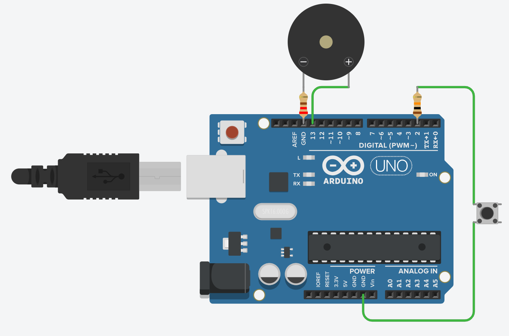

# 🧊 Fridge Door Alarm System

[](https://github.com/)
[](https://github.com/)
[](https://github.com/)


## 📋 Table of Contents
- [Introduction](#introduction)
- [System Overview](#system-overview)
- [Components Required](#components-required)
- [Circuit Diagram](#circuit-diagram)
- [Implementation Procedure](#implementation-procedure)
- [Code](#code)
- [Benefits](#benefits)
- [Applications](#applications)
- [Budget](#budget)
- [Conclusion](#conclusion)

## 🔍 Introduction

This project aims to simulate a fridge door alarm system using an Arduino and a push button. The system will alert users with a buzzer if the "fridge door" is left open for too long, helping prevent energy waste and food spoilage.

## 🔄 System Overview


### How It Works

1. The push button simulates the fridge door state (pressed = closed, released = open)
2. When the door is "open" (button released), a timer starts
3. If the door remains open for more than 10 seconds, the buzzer activates
4. Closing the door (pressing the button) resets the system and turns off the alarm

## 🛒 Components Required

| Component | Quantity | Purpose |
|-----------|----------|---------|
| Arduino UNO | 1 | Main controller |
| Push Button | 1 | Door state simulation |
| Buzzer | 1 | Audio alarm |
| 10kΩ Resistor | 1 | Pull-up resistor for button |
| Jumper Wires | ~10 | Connections |

## 🖼️ Schematic Diagram


## ⚡ Circuit Diagram



## 🛠️ Implementation Procedure

### Step 1: Connect Components
- Connect the push button to Pin 2 with a 10kΩ pull-up resistor
- Connect the buzzer to Pin 3

### Step 2: Upload the Code
- Use the Arduino IDE to upload the provided code (see [Code Section](#code))

### Step 3: Test the System
- Press the button (door closed) → Buzzer is off
- Release the button (door open) → If open for 10+ seconds, the buzzer sounds
- Press the button again → System resets, turning off the alarm

## 💻 Code

```cpp
#define BUTTON 2
#define OUT 13 
#define REACTION_TIME 10000  // 10 seconds

unsigned long doorOpenTime = 0;

void setup() {
  pinMode(BUTTON, INPUT_PULLUP);
  pinMode(OUT, OUTPUT);
  Serial.begin(9600);
}

void loop() {
  int buttonState = digitalRead(BUTTON);

  if (buttonState == LOW) {  // Button pressed (door closed)
    doorOpenTime = millis();  // Reset timer when door is closed
    digitalWrite(OUT, LOW);
  } else {  // Button released (door open)
    // Check if door has been open longer than the reaction time
    if (millis() - doorOpenTime > REACTION_TIME) {
      digitalWrite(OUT, HIGH);
    }
  }
}
```

## 💡 Benefits

- **Simple & Cost-Effective**: Uses minimal components for a functional alarm system
- **No Physical Crafting Required**: Works as a tabletop simulation without complex construction
- **Hands-On Arduino Learning**: Covers input handling, timers, and output control
- **Expandable**: Can be upgraded with an LCD display, wireless alerts, or real sensors

## 🏆 Applications

- **Home Appliances**: Can be modified for real fridge doors
- **Cabinet Alarm**: Detects when a drawer or cupboard is left open
- **Reminder Systems**: Can be used for security alerts in small enclosures
- **Educational Tool**: Demonstrates basic sensor-based alert systems for students

## 💰 Budget

| Component | Estimated Cost |
|-----------|----------------|
| Arduino UNO | 1000৳ |
| Push Button | 25৳ |
| Buzzer | 20৳ |
| Resistors | 5৳ |
| Jumper Wires | 30৳ |
| **Total Estimated Budget** | **1080৳** |

## 🎯 Conclusion

This Fridge Door Alarm System is a simple, low-cost project ideal for beginners learning Arduino programming. It effectively demonstrates how an alert system works without requiring complex hardware or crafting. The project provides a foundation for understanding time-based alerts and input/output operations in embedded systems.